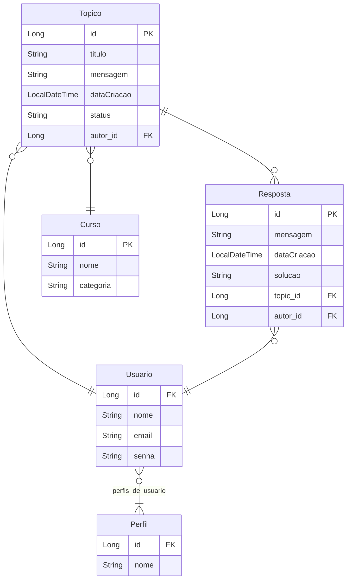

# 📖Forum Hub
🌎[@Alura](https://www.alura.com.br/) [@Oracle](https://www.oracle.com/br/)<br>
🤙Alura ONE G7 Challenges<br>
🚩`Especialização Back-End/Java e Spring Framework`<br>
📅Wednesday, 18th December 2024 -📍São Paulo, Brazil<br>

## Descrição do desafio
Esté é um desafio proposto pelo programa [ONE](https://www.oracle.com/br/education/oracle-next-education/) para desenvolver uma aplicação _backend_ que simule um Forúm, com seus Tópicos que devem receber respostas dos usuário para solucioná-lo, cada tópico tratá-se de uma problemática de algum curso que um usuário abril, o foco da criação do tópico é conseguir resposstas de outros usuário que possam ajudar:

- Tópicos:
  - Registrar
  - Listagem paginada
  - Listagem por nome de curso
  - Listagem pelos 10 primeiros por data de criação
  - Listagem por ano de criação
  - Encontrar por identificação
  - Atualizar por identificação
  - Fechar um tópico
  - Deletar por identificação
- Cursos:
  - Registrar 
  - Atualizar por identificação
  - Listagem paginada
  - Encontrar por identificação
  - Deletar por identificação
- Respostas:
  - Registrar
  - Encontrar por identificação
  - Deletar por identificação
- Usuários:
  - Registrar
  - Encontrar por nome de usuário
  - Atualizar por identificação
  - Deletar por identificação
- Perfis de usuário:
  - Registrar
  - Atualizar por identificação
  - Deletar por identificação
  - Encontrar por identificação
  - Encontrar por nome
  - Listagem paginada
- Autenticação
  - Login de usuário

## Utilização
Para conseguir utilizar o desafio ForumHub, é necessário possuir o banco de dados `MySQL` ativo para que a aplicação consiga se conectar e realizar as operações.

A aplicação possui o arquivo `docker-compose.yml` que irá servir para conseguir subir containers do `SGBD MySQL`, e para conseguir fazer esse processo, basta utilizar o comando no terminal, estando no diretório do desafio:
```bash
docker-compose up -d
```

Analise se os containers estão rodando no Docker, existirá 2 containers do `MySQL`, um servirá para o _Perfil de Aplicação_ de `Test/test` e o outro para `Production/prod`.

Para alterar o _Perfil de Aplicação_ de `Test` para `Production` ou vice-versa, basta ir no arquivo `application.properties` e modificar o campo `spring.profiles.active` de `test` para `prod` que irá carregar o arquivo correspondente:

- `test`: arquivo -> `application-test.properties`
- `prod`: arquivo -> `application-prod.properties`

### Rotas e Documentação
Para conhecer as rotas da aplicação `ForumHub`.

- _Documentação da API_ 👉 `http://{host}:{port}/swagger-ui/index.html`
- Tópicos 👉 `http://{host}:{port}/topicos/**`
- Respostas 👉 `http://{host}:{port}/respostas/**`
- Cursos 👉 `http://{host}:{port}/cursos/**`
- Usuários 👉 `http://{host}:{port}/usuarios/**`
- Perfis de usuário 👉 `http://{host}:{port}/perfis/**`
- Autenticação de usuário 👉 `http://{host}:{port}/login`

## Mapeamento Diagrama Entidade Relacionamento
