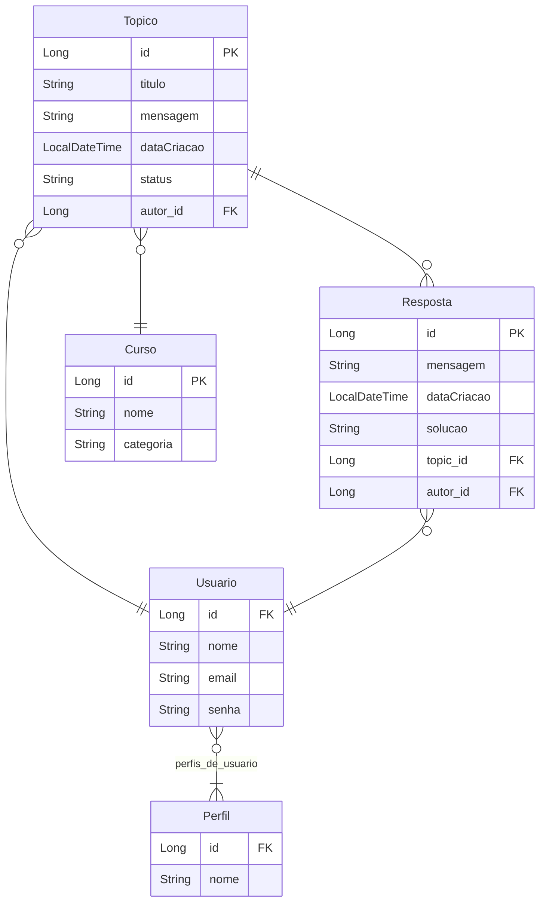

# 📖Forum Hub 
🌎[@Alura](https://www.alura.com.br/) [@Oracle](https://www.oracle.com/br/)<br>
🤙Alura ONE G7 Challenges<br>
🚩`Especialização Back-End/Java e Spring Framework`<br>
📅Wednesday, 18th December 2024 -📍São Paulo, Brazil<br>


## Descrição do desafio
Esté é um desafio proposto pelo programa [ONE](https://www.oracle.com/br/education/oracle-next-education/) para desenvolver uma aplicação _backend_ que simule um Forúm, com seus Tópicos que devem receber respostas dos usuário para solucioná-lo, cada tópico tratá-se de uma problemática de algum curso que um usuário abril. O foco da criação do tópico é conseguir respostas de outros usuário que possam ajudar.

Além de que, para modificações ou acesso dos recursos como exclução, atualização e alteração de status do tópico, o usuário logado deve ser o dono/criador do mesmo, ou caso seja um usuário Administrador. Também ocorre nas respostas que podem ser excluídas apenas por seus criadores.

Cursos devem ser registrados no sistema apenas por Administradores, assim como as demais operações, com a excessão da consulta de cursos.

Abaixo é possivel ver a lista das operações:

- Tópicos:
  - Registrar
  - Listagem paginada 
  - Listagem por nome de curso
  - Listagem pelos 10 primeiros por data de criação
  - Listagem por ano de criação
  - Encontrar por identificação
  - Atualizar por identificação
  - Fechar um tópico
  - Deletar por identificação
- Cursos:
  - Registrar 
  - Atualizar por identificação
  - Listagem paginada
  - Encontrar por identificação
  - Deletar por identificação
- Respostas:
  - Registrar
  - Encontrar por identificação
  - Deletar por identificação
- Usuários:
  - Registrar
  - Encontrar por nome de usuário
  - Atualizar por identificação
  - Deletar por identificação
- Perfis de usuário:
  - Registrar
  - Atualizar por identificação
  - Deletar por identificação
  - Encontrar por identificação
  - Encontrar por nome
  - Listagem paginada
- Autenticação
  - Login de usuário

## Utilização
Para conseguir utilizar o desafio ForumHub, é necessário possuir o banco de dados `MySQL` ativo para que a aplicação consiga se conectar e realizar as operações.

A aplicação possui o arquivo `docker-compose.yml` que irá servir para conseguir subir containers do `SGBD MySQL`, e para conseguir fazer esse processo, basta utilizar o comando no terminal, estando no diretório do desafio:
```bash
docker-compose up -d
```

Analise se os containers estão rodando no Docker, existirá 2 containers do `MySQL`, um servirá para o _Perfil de Aplicação_ de `Test/test` e o outro para `Production/prod`.

Para alterar o _Perfil de Aplicação_ de `Test` para `Production` ou vice-versa, basta ir no arquivo `application.properties` e modificar o campo `spring.profiles.active` de `test` para `prod` que irá carregar o arquivo correspondente:

- `test`: arquivo -> `application-test.properties`
- `prod`: arquivo -> `application-prod.properties`

### Rotas e Documentação
Para conhecer as rotas da aplicação `ForumHub`.

- _Documentação da API_ 👉 `http://{host}:{port}/swagger-ui/index.html`
- Tópicos 👉 `http://{host}:{port}/topicos/**`
- Respostas 👉 `http://{host}:{port}/respostas/**`
- Cursos 👉 `http://{host}:{port}/cursos/**`
- Usuários 👉 `http://{host}:{port}/usuarios/**`
- Perfis de usuário 👉 `http://{host}:{port}/perfis/**`
- Autenticação de usuário 👉 `http://{host}:{port}/login`

## Mapeamento Diagrama Entidade Relacionamento


## Observação
* Nos testes, realizei apenas para os Tópicos, sendo eles o básico para um mapeamento CRUD (Create, Read, Update, Delete).
